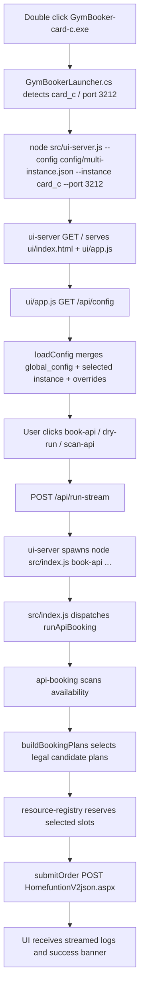

# 北京科技大学体育馆抢场工具源码分析

> 版本：`2.2.6`  
> 目标：帮助初学者真正读懂这个项目的工作流、原理和架构。

## 目录

1. [项目总览](#1-项目总览-project-overview)
2. [项目整体结构](#2-项目整体结构-overall-structure)
3. [核心模块构成](#3-核心模块构成-core-components)
4. [完整工作流](#4-完整工作流-end-to-end-workflow)
5. [核心原理](#5-核心原理-working-principle)
6. [关键文件精讲](#6-关键文件精讲-key-files-explained)
7. [关键函数和调用链](#7-关键函数和调用链-key-functions-and-call-chain)
8. [数据流和控制流](#8-数据流和控制流-data-flow-and-control-flow)
9. [依赖与外部组件](#9-依赖与外部组件-dependencies-and-external-interfaces)
10. [启动方式与运行条件](#10-启动方式与运行条件-startup-and-runtime-requirements)
11. [最小可理解路径](#11-最小可理解路径-minimum-learning-path)
12. [名词对照](#12-名词对照-glossary)
13. [初学者复习精简版](#13-初学者复习精简版-beginner-review)

## 1 项目总览

这个项目是一个专门给北京科技大学体育馆移动端订场系统用的本地自动化工具。

它解决的问题是：原网页 UI 卡、微信公众号页面难拖动、9 点放场时手动操作太慢，所以项目把“看场地、选时段、筛价格、过滤校内不可用时段、提交订单、多账号协同”做成本地脚本和本地 UI。

输入 input 主要来自配置文件和 UI 表单，包括：

- `bookingPageUrl`
- `wxkey`
- `bookingWindow.date`
- `bookingWindow.segments`
- `preferences.courtNumbers`
- `rules.blockedPrices`
- `releaseAt`
- `instance.name`
- `server.port`

输出 output 有三类：

- 本地 UI 显示的场地可视化和日志 local UI court map and logs
- 终端日志 terminal logs
- 真实提交给体育馆后端的订单结果 backend booking result，例如 `Submit response: [true, "...", null, null]`

核心价值 core value 是：把高延迟 UI 操作压缩成后端 API 链路，先扫描最新可用场地，再提交候选组合，同时多账号用共享资源池避免互相抢同一片。

## 2 项目整体结构 Overall Structure

项目根目录 project root 是：

```text
C:\Users\86515\Documents\Codex\GymBooker
```

目录树 directory tree：

```text
GymBooker/
├─ src/
│  ├─ index.js
│  ├─ config.js
│  ├─ api-booking.js
│  ├─ booking.js
│  ├─ resource-registry.js
│  ├─ ui-server.js
│  └─ logger.js
├─ ui/
│  ├─ index.html
│  ├─ app.js
│  └─ styles.css
├─ config/
│  ├─ example.json
│  ├─ multi-instance.example.json
│  ├─ local.json                  ignored local real config
│  └─ multi-instance.json         ignored local real multi-account config
├─ launcher/
│  └─ GymBookerLauncher.cs
├─ scripts/
│  └─ build-launcher.ps1
├─ test/
│  ├─ api-booking.test.js
│  ├─ config.test.js
│  └─ resource-registry.test.js
├─ package.json
├─ package-lock.json
├─ README.md
└─ .gitignore
```

重要目录和文件说明 important directories and files：

| 路径 Path | 作用 Role |
|---|---|
| `src/index.js` | 命令行入口 CLI entry，把 `capture-session`、`book`、`book-api`、`scan-api` 分发到不同模块。 |
| `src/config.js` | 配置加载器 config loader，负责单实例和多实例配置合并、命令行覆盖、字段校验。 |
| `src/api-booking.js` | 最核心的直接 API 抢场逻辑 direct API booking core，包括扫描、候选生成、下单、失败分类、校内规则过滤。 |
| `src/booking.js` | `Playwright` 浏览器自动化 browser automation，保留为 UI 点击式备选方案。 |
| `src/resource-registry.js` | 多实例资源协调 shared resource registry，用文件锁和 JSON 状态避免多账号重复选同一资源。 |
| `src/ui-server.js` | 本地 HTTP 服务 local UI server，给前端页面提供配置、运行脚本、实时日志、刷新场地接口。 |
| `ui/app.js` | 前端控制台逻辑 frontend app，负责表单、按钮、日志流、场地可视化、取消任务。 |
| `ui/index.html` | 前端页面结构 HTML shell。 |
| `ui/styles.css` | UI 样式 CSS。 |
| `launcher/GymBookerLauncher.cs` | Windows exe 启动器 launcher，双击后启动 `src/ui-server.js` 并打开浏览器。 |
| `scripts/build-launcher.ps1` | 编译 C# launcher 的 PowerShell 脚本。 |
| `config/example.json` | 单账号示例配置 single-instance example。 |
| `config/multi-instance.example.json` | 三账号示例配置 multi-instance example，包含 `card_a`、`card_b`、`card_c`。 |
| `test/api-booking.test.js` | 核心抢场算法测试。 |
| `test/config.test.js` | 多实例配置加载测试。 |
| `test/resource-registry.test.js` | 资源锁冲突测试。 |

## 3 核心模块构成 Core Components

| 模块 Component | 输入 Input | 输出 Output | 依赖 Depends on | 被谁调用 Called by |
|---|---|---|---|---|
| `loadConfig` in `src/config.js` | `configPath`、`instanceName`、CLI overrides | 合并后的 `config` | `fs`、`path` | `src/index.js`、`src/ui-server.js` |
| `runApiBooking` in `src/api-booking.js` | `config` | 真实下单结果或错误 | `createResourceRegistry`、后端 API | CLI `book-api`、UI `/api/run-stream` |
| `runAvailabilityScan` in `src/api-booking.js` | `config.scan`、日期、时段 | 可用场地文本日志 | 后端 availability API | CLI `scan-api`、UI 扫描按钮 |
| `getStructuredAvailability` in `src/api-booking.js` | `config` | 结构化场地图 summary | `fetchAvailability`、`buildAvailabilitySummary` | UI `/api/availability` |
| `createResourceRegistry` in `src/resource-registry.js` | `coordination` 配置 | `FileResourceRegistry` 或 `DisabledResourceRegistry` | `fs`、`path` | `runApiBooking` |
| `FileResourceRegistry` in `src/resource-registry.js` | slots、runtime | reserve/release/markBooked 结果 | JSON state file、file lock | `reserveSelectedSlots`、`getBlockedResourceIdsForRuntime` |
| `ui-server` in `src/ui-server.js` | HTTP requests | JSON、text stream、static files | `http`、`child_process`、`loadConfig` | 浏览器前端 `ui/app.js` |
| `ui/app.js` in `ui/app.js` | 用户点击和表单 | 本地页面状态、日志、场地图 | local HTTP API | 用户浏览器 |
| `runBooking` in `src/booking.js` | `config` | 浏览器自动点击订场 | `playwright` | CLI `book` |
| `GymBookerLauncher` in `launcher/GymBookerLauncher.cs` | exe 文件名或参数 | 启动本地 UI server | Node.js、Windows Forms | 双击 exe |

## 4 完整工作流 End to End Workflow

### 4.1 主流程一：本地 UI 抢场 Local UI booking workflow



### 4.2 主流程二：命令行直接抢场 CLI direct API workflow

```text
PowerShell
-> node src/index.js book-api --config ... --instance card_a --date ... --times ...
-> parseArgs
-> loadConfig
-> runApiBooking
-> waitUntilReleaseTime
-> fetchAvailability
-> buildPlansForRuntime
-> reserveSelectedSlots
-> submitOrderWithFastRetry
-> classify result
-> success / continue / fatal stop
```

### 4.3 主流程三：快速扫描 Scan workflow

```text
UI refresh / scan-api
-> getStructuredAvailability 或 runAvailabilityScan
-> fetchAvailability
-> buildAvailabilitySummary
-> apply campusAvailabilityRules
-> group by court and price
-> renderCourtMap 或 console lines
```

### 4.4 辅助流程四：浏览器自动化 Browser automation workflow

```text
node src/index.js capture-session
-> captureSession
-> Playwright opens loginUrl
-> user manually logs in
-> storageState saved

node src/index.js book
-> runBooking
-> Playwright opens bookingPageUrl
-> clickTargetDate / findGridTarget / confirmBooking
```

### 4.5 辅助流程五：多实例协调 Multi-instance coordination workflow

```text
card_a selects Court12@13:00-14:00
-> FileResourceRegistry.reserveSlots writes .coordination/resource-registry.json
-> card_b/card_c getBlockedResourceIds
-> buildBookingPlans excludes that resource
-> TTL expires or releaseSlots clears if failed
-> markBooked keeps booked lock for bookedTtlMs
```

## 5 核心原理 Working Principle

### 5.1 扫描优先 scan-first

`runApiBooking` 不盲目提交，它先调用 `fetchAvailability` 拿后端最新场地，再用 `buildBookingPlans` 生成合法组合。这样避免“根据旧页面猜测下单”。

### 5.2 单飞提交 single-submit-flight

同一实例同一时间只提交一个订单请求。`startSubmitPrefetchScanner` 会在等待提交返回时后台扫描，但不会发第二个 submit。原因是每天只能订一次，乱发第二单可能直接浪费额度。

### 5.3 提交中预扫描 submit-time prefetch

`startSubmitPrefetchScanner` 在订单请求挂起时持续 `fetchAvailability`，这样如果后端明确返回失败，程序可以用更新后的候选队列继续，而不是重新从零等下一轮 UI 刷新。

### 5.4 候选计划 candidate plans

`buildBookingPlans` 会根据 `runtime.timeWindows` 判断是多时段还是单时段，然后走 `buildPlansByTimeWindow` 或 `buildPlansForSingleWindow`。两片场地默认要求时间不同，这通过每个 `timeWindow` 取一个候选实现。

### 5.5 多账号资源池 shared resource registry

`FileResourceRegistry` 用 `.coordination/resource-registry.json` 存已选资源，用 `.coordination/resource-registry.lock` 做文件锁 file lock。它不是复杂数据库，而是单机轻量方案，适合当前场景：同一台机器三开。

### 5.6 校内开放规则 campus availability rules

`isCampusSlotAllowed` 会根据 `campusAvailabilityRules.weekdays` 判断某个 `courtNo + timeRange` 是否可选。没有命中任何规则的时段默认开放，这是解决“没提到的都是正常”的关键。

### 5.7 失败分类 failure classification

`classifyBookingFailure` 把后端返回分成几类：

- `daily-limit`：直接停止
- `rate-limit`：直接停止
- `release-not-open`：继续扫描
- 普通业务失败：临时拉黑目标资源
- 网络超时 / HTTP 504：不是确定结果，所以继续扫描

### 5.8 前后端通信 frontend-backend communication

浏览器页面 `ui/app.js` 不是直接碰体育馆后端，而是请求本地 `ui-server`。`ui-server` 再 spawn 子进程执行 CLI，这样日志能流式返回，取消按钮也能 kill 当前任务。

## 6 关键文件精讲 Key Files Explained

### 6.1 `src/index.js`

`src/index.js` 是 CLI 总入口。它只做三件事：

1. 读命令 `command`
2. 解析参数 `parseArgs`
3. 调用对应函数

它负责把命令分发到：

- `captureSession`
- `runBooking`
- `runApiBooking`
- `runAvailabilityScan`

这个文件不看会不知道 `book-api`、`scan-api`、`book`、`capture-session` 是怎么分流的。

### 6.2 `src/config.js`

`src/config.js` 是配置合并中心。`normalizeConfigDocument` 支持两种配置形态：

- 单实例 `config/local.json`
- 多实例 `config/multi-instance.json`

多实例时，它会从 `instances` 中选 `card_a/card_b/card_c`，再把 `global_config.base_config` 和实例自己的 `config` 合并。

这个文件不看会不懂为什么 3210/3211/3212 能共享大部分配置但用不同 `wxkey`。

### 6.3 `src/api-booking.js`

`src/api-booking.js` 是项目心脏。它包含：

- `runApiBooking`
- `fetchAvailability`
- `buildBookingPlans`
- `submitOrder`
- `classifyBookingFailure`
- `isCampusSlotAllowed`

这个文件不看就无法理解真正的抢场算法。

### 6.4 `src/resource-registry.js`

`src/resource-registry.js` 是三开协同的核心。它定义 `FileResourceRegistry`，负责：

- `getBlockedResourceIds`
- `reserveSlots`
- `releaseSlots`
- `markBooked`

这个文件不看会误以为多开只是开三个端口，其实关键是共享锁。

### 6.5 `src/ui-server.js`

`src/ui-server.js` 是本地 UI 的后端。它提供：

- `GET /api/config`
- `GET /api/logs`
- `POST /api/config`
- `POST /api/run-stream`
- `POST /api/cancel`
- `POST /api/availability`

这个文件不看会不懂前端按钮为什么能运行 Node 脚本。

### 6.6 `ui/app.js`

`ui/app.js` 是前端控制逻辑。

关键函数包括：

- `bootstrap`
- `runAction`
- `refreshAvailabilityMap`
- `renderCourtMap`
- `updateHourOptionAvailability`
- `updateCourtOptionAvailability`

它负责表单、按钮、日志流、场地可视化、取消任务和校内规则的前端展示。

### 6.7 `src/booking.js`

`src/booking.js` 是旧式浏览器自动化方案。它用 `Playwright` 打开页面、点击日期、找格子、确认订单。现在主力是 `book-api`，但 `booking.js` 仍然是备用和登录保存 session 的基础。

### 6.8 `launcher/GymBookerLauncher.cs`

`launcher/GymBookerLauncher.cs` 是 exe 外壳。`ApplyDefaultsFromExeName` 会识别文件名：

- `card-a` 映射 3210
- `card-b` 映射 3211
- `card-c` 映射 3212

这个文件不看会不懂为什么复制同一个 exe 改名就能三开。

## 7 关键函数和调用链 Key Functions and Call Chain

### 7.1 CLI 调用链 CLI call chain

```text
main in src/index.js
-> parseArgs
-> loadConfig in src/config.js
-> runApiBooking / runAvailabilityScan / runBooking / captureSession
```

### 7.2 API 抢场调用链 API booking call chain

```text
runApiBooking
-> createRuntime
-> createResourceRegistry
-> waitUntilReleaseTime
-> fetchAvailability
-> buildPlansForRuntime
-> getBlockedResourceIdsForRuntime
-> buildBookingPlans
-> reserveSelectedSlots
-> buildBookingPayload
-> startSubmitPrefetchScanner
-> submitOrderWithFastRetry
-> submitOrder
-> classifyBookingFailure / isSuccessfulBookingResult
-> markBooked / releaseSlots
```

### 7.3 候选生成调用链 candidate generation call chain

```text
buildBookingPlans
-> buildPlansByTimeWindow 或 buildPlansForSingleWindow
-> collectCandidatesForWindow 或 collectCandidatesForWindows
-> iterateAvailableSlots
-> isCampusSlotAllowed
-> compareCandidates
-> comparePlans
```

### 7.4 场地可视化调用链 court map call chain

```text
ui/app.js refreshAvailabilityMap
-> POST /api/availability
-> ui-server mergeConfigWithBody
-> getStructuredAvailability
-> fetchAvailability
-> buildAvailabilitySummary
-> renderCourtMap
-> groupSlotsByPrice
```

### 7.5 多实例锁调用链 coordination call chain

```text
reserveSelectedSlots
-> registry.reserveSlots
-> FileResourceRegistry.withLock
-> acquireLock
-> readState
-> conflict detection
-> writeState
-> releaseLock
```

### 7.6 浏览器自动化调用链 browser automation call chain

```text
runBooking
-> waitUntilReleaseTime
-> chromium.launchPersistentContext 或 chromium.launch
-> clickTargetDate
-> tryBookGridSlot 或 tryBookListSlot
-> findGridTarget
-> confirmBooking
```

## 8 数据流和控制流 Data Flow and Control Flow

### 8.1 配置数据流 config data flow

数据流 data flow 从配置开始。

`config/local.json` 或 `config/multi-instance.json` 被 `loadConfig` 读入，合并成 `config`。

`createRuntime` 再把 `config` 转成运行期对象 `runtime`，里面有：

- `wxkey`
- `lxbh`
- `bookingDate`
- `timeWindows`
- `blockedPriceSet`
- `preferredCourts`
- `requestHeaders`

### 8.2 扫描数据流 availability data flow

`fetchAvailability` 请求体育馆后端 `GetForm.aspx`，返回 JSON，代码取 `data[1]` 并 `JSON.parse` 成 `availability.rows`。

每一行代表一个时间段，每个 `cdbhN/cN/priceN` 代表一个场地格子。

`iterateAvailableSlots` 把这些原始字段变成统一 slot 对象。

### 8.3 下单数据流 booking payload data flow

候选 slots 进入 `buildBookingPayload`，生成：

```js
{
  datestring,
  cdstring,
  paytype
}
```

其中 `cdstring` 格式类似：

```text
Y:18,8:00-9:00;Y:19,18:00-19:00;
```

然后 `submitOrder` 用 `URLSearchParams` 发 POST 到 `HomefuntionV2json.aspx`，参数包括：

- `searchparam`
- `wxkey`
- `classname`
- `funname`

### 8.4 控制流 control flow

控制流 control flow 的关键判断在 `runApiBooking`。

如果没有候选计划，sleep 后继续 scan。

如果有候选，先 reserve，再 submit。

submit 返回成功就结束；返回每日限制 daily-limit 也结束；返回未上线 release-not-open 就不拉黑，重新扫描；返回普通失败就短暂拉黑这个目标组合；网络错误就释放锁并继续扫描，因为它不能证明订单成功或失败。

### 8.5 状态切换 state transitions

状态切换 state transitions 主要在资源池。

slot 初始不在 registry，选中后变成 `selected`，成功且能确认足够订单号后变成 `booked`，失败或未知结果后 `releaseSlots` 移除。

TTL 机制让崩溃实例的 `selected` 最终过期。

### 8.6 前端控制流 frontend control flow

前端控制流 frontend control flow 是事件驱动 event-driven。

`bindEvents` 把输入框、按钮绑定到：

- `handleConfigChanged`
- `runAction`
- `refreshAvailabilityMap`
- `cancelCurrentRun`

`runAction` 用 `fetch('/api/run-stream')` 读取流式日志，持续更新 output 和 success banner。

## 9 依赖与外部组件 Dependencies and External Interfaces

| 依赖 Dependency | 类型 Type | 作用 Role |
|---|---|---|
| `Node.js` | runtime | 运行所有 `src/*.js`、本地 HTTP server、测试。 |
| `Playwright` | npm dependency | 用于 `capture-session` 和 `book` 浏览器自动化。 |
| `node:http` | Node built-in | `src/ui-server.js` 本地 HTTP 服务。 |
| `node:child_process` | Node built-in | UI 后端启动 `src/index.js` 子进程并流式返回日志。 |
| `node:test` | Node built-in | 测试框架。 |
| `Windows Forms` | .NET | C# launcher 弹错误框和启动浏览器。 |
| 体育馆后端 `GetForm.aspx` | external API | 查询可用场地 availability。 |
| 体育馆后端 `HomefuntionV2json.aspx` | external API | 提交订单 booking submit。 |
| 本地 API `/api/config` | local API | 前端获取当前配置。 |
| 本地 API `/api/run-stream` | local API | 前端启动 `book-api` 或 `scan-api` 并接收实时日志。 |
| 本地 API `/api/availability` | local API | 前端获取结构化场地可视化数据。 |
| 本地 API `/api/cancel` | local API | 前端取消当前运行中的子进程。 |

外部体育馆接口里，`submitOrder` 使用的 `classname` 是 `saasbllclass.CommonFuntion`，`funname` 是 `MemberOrderfromWx`。

这不是项目自己发明的协议，而是根据原网页调用方式复现出来的后端接口。这里的接口行为来自实际观察，细节仍可能被学校系统更新改变。

## 10 启动方式与运行条件 Startup and Runtime Requirements

运行条件 runtime requirements：

- Windows
- `Node.js`
- `npm`
- `Playwright`
- 有效的 `bookingPageUrl`
- 有效的 `wxkey`

如果用 `book` 或 `capture-session`，还需要：

```powershell
npx.cmd playwright install chromium
```

如果只用 `book-api` 和 `scan-api`，主流程不依赖浏览器点击，但仍需要有效 `wxkey`。

### 10.1 安装 install

```powershell
cd C:\Users\86515\Documents\Codex\GymBooker
npm.cmd install
npx.cmd playwright install chromium
```

### 10.2 本地 UI local UI

```powershell
npm.cmd run ui
```

### 10.3 三开 multi-instance

```powershell
node src/ui-server.js --config config/multi-instance.json --instance card_a --port 3210
node src/ui-server.js --config config/multi-instance.json --instance card_b --port 3211
node src/ui-server.js --config config/multi-instance.json --instance card_c --port 3212
```

### 10.4 exe 三开 launcher

```powershell
dist\GymBooker-card-a.exe
dist\GymBooker-card-b.exe
dist\GymBooker-card-c.exe
```

### 10.5 直接扫描 direct scan

```powershell
npm.cmd run scan-api -- --date 2026-04-24 --times 12:00-13:00,17:00-18:00 --scan-loops 10 --scan-interval-ms 500
```

### 10.6 直接模拟 dry-run

```powershell
npm.cmd run book-api -- --date 2026-04-24 --times 12:00-13:00,17:00-18:00 --courts 11,12,13 --dry-run
```

### 10.7 直接正式抢 real book-api

```powershell
npm.cmd run book-api -- --config config/multi-instance.json --instance card_a --date 2026-04-24 --times 12:00-13:00,17:00-18:00 --release-at "2026-04-17 09:00"
```

必须满足 preconditions：

- `bookingPageUrl` 里有有效 `wxkey`
- `rules.blockedPrices` 合理
- `campusAvailabilityRules` 与真实开放规则一致
- 三开时每个实例端口不同
- 三开时每个实例 key 不同
- 三开时每个实例 storage state 不同

## 11 最小可理解路径 Minimum Learning Path

最快阅读顺序 minimum path：

1. 先看 `README.md`，只看命令和配置概念。
2. 再看 `config/multi-instance.example.json`，理解 `global_config`、`instances`、`coordination`。
3. 再看 `src/index.js`，理解四个命令如何分发。
4. 再看 `src/config.js`，理解配置怎么合并。
5. 重点看 `src/api-booking.js` 的 `runApiBooking`，先不要看所有 helper。
6. 接着看 `src/api-booking.js` 的 `buildBookingPlans`、`fetchAvailability`、`submitOrder`、`classifyBookingFailure`。
7. 再看 `src/resource-registry.js`，理解多开为什么不会撞。
8. 如果想懂 UI，再看 `src/ui-server.js` 和 `ui/app.js`。
9. 最后看 `test/api-booking.test.js`，用测试反推设计意图。

## 12 名词对照 Glossary

| 中文解释 | English Original Name |
|---|---|
| 项目名 | `School Gym Booker` |
| npm 包名 | `school-gym-booker` |
| 直接 API 抢场 | `book-api` |
| 浏览器自动化抢场 | `book` |
| 快速扫描 | `scan-api` |
| 保存登录会话 | `capture-session` |
| 配置加载 | `loadConfig` |
| 多实例配置 | `multi-instance config` |
| 全局配置 | `global_config` |
| 实例列表 | `instances` |
| 实例名 | `instance.name` |
| 监听端口 | `server.port` |
| 订场页面 URL | `bookingPageUrl` |
| 微信 key | `wxkey` |
| 场馆类型 | `lxbh` |
| 订场窗口 | `bookingWindow` |
| 多时段 | `bookingWindow.segments` |
| 场地偏好 | `preferences.courtNumbers` |
| 禁抢价格 | `rules.blockedPrices` |
| 允许只抢一片 | `rules.allowSingleSlot` |
| 校内开放规则 | `campusAvailabilityRules` |
| 资源协调 | `coordination` |
| 共享资源池 | `resource registry` |
| 文件锁 | `file lock` |
| 已选择资源 | `selected` |
| 已预订资源 | `booked` |
| 候选计划 | `candidate plan` |
| 提交中预扫描 | `submit-time prefetch` |
| 单飞提交 | `single-submit-flight` |
| 失败分类 | `classifyBookingFailure` |
| 每日次数限制 | `daily-limit` |
| 限流提示 | `rate-limit` |
| 未上线提示 | `release-not-open` |
| 本地 UI 服务 | `ui-server` |
| 场地可视化 | `court map` |
| Windows 启动器 | `GymBookerLauncher` |

## 13 初学者复习精简版 Beginner Review

这个项目可以理解成三层：

1. 前端控制台 `ui/app.js`
2. 本地后端 `src/ui-server.js`
3. 核心抢场引擎 `src/api-booking.js`

用户在浏览器点按钮，前端发请求给本地后端，本地后端启动 `node src/index.js book-api`，然后核心引擎去体育馆后端扫描场地、生成候选、加共享锁、提交订单、根据结果继续或停止。

最重要的文件是 `src/api-booking.js`。

它的主线是：

```text
runApiBooking
-> fetchAvailability
-> buildBookingPlans
-> reserveSelectedSlots
-> submitOrder
-> classify result
```

如果只看懂这一条线，就能理解项目 70% 的工作方式。

多开不是简单开三个网页，而是 `config/multi-instance.json` 里有 `card_a/card_b/card_c`，每个实例有自己的 `wxkey` 和端口，同时它们共享 `resource-registry.json`。这样 A 选了某个 `Court + timeRange`，B 和 C 会自动避开。

UI 的场地可视化不是截图识别，而是调用后端 availability API，把返回的场地数据整理成 `summary.courts`，再由 `renderCourtMap` 画出来。灰掉的格子来自 `campusAvailabilityRules` 和 `blockedPrices`。

设计上最关键的原则是：

- 先扫描再下单 scan-first
- 同一实例同时只飞一个订单 single-submit-flight
- 等待下单结果时可以预扫描 prefetch
- 预扫描绝不盲目发第二单

这样兼顾速度和不乱用每日订场次数。
